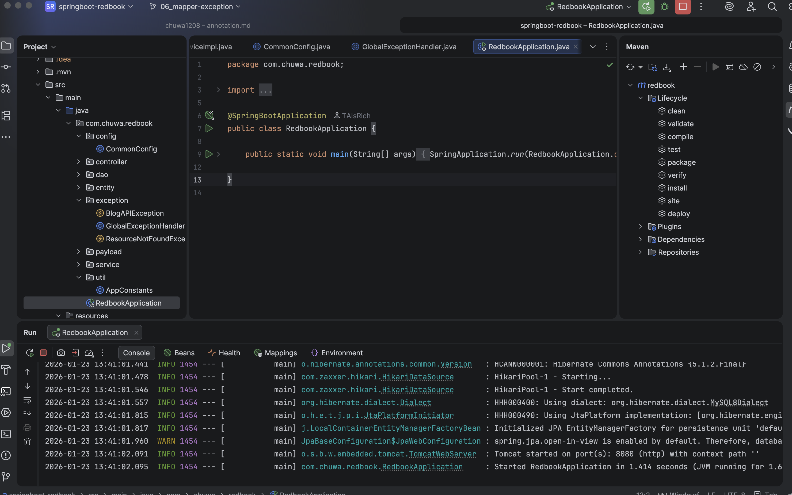
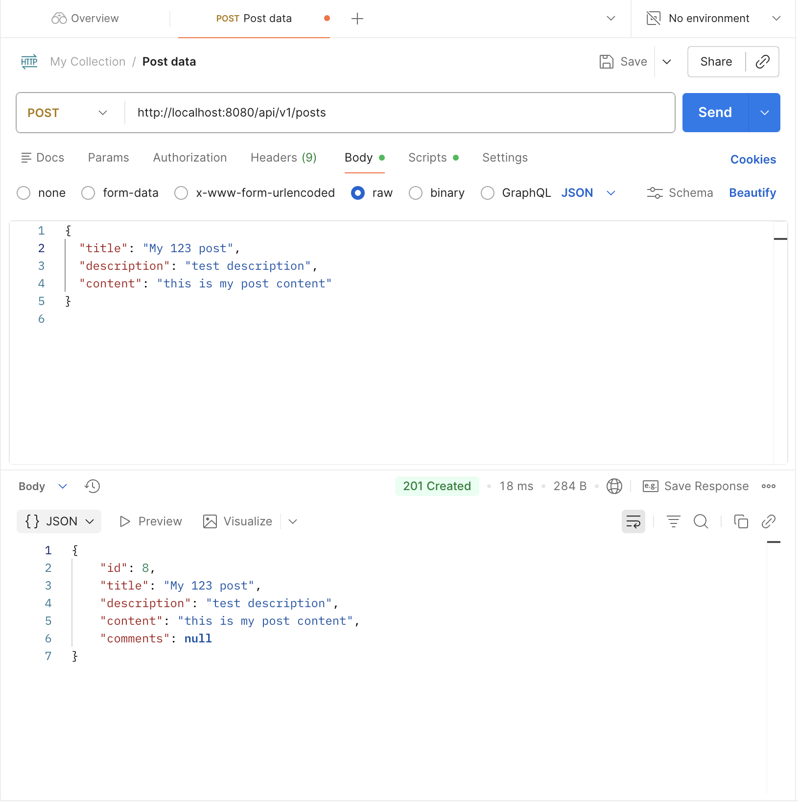
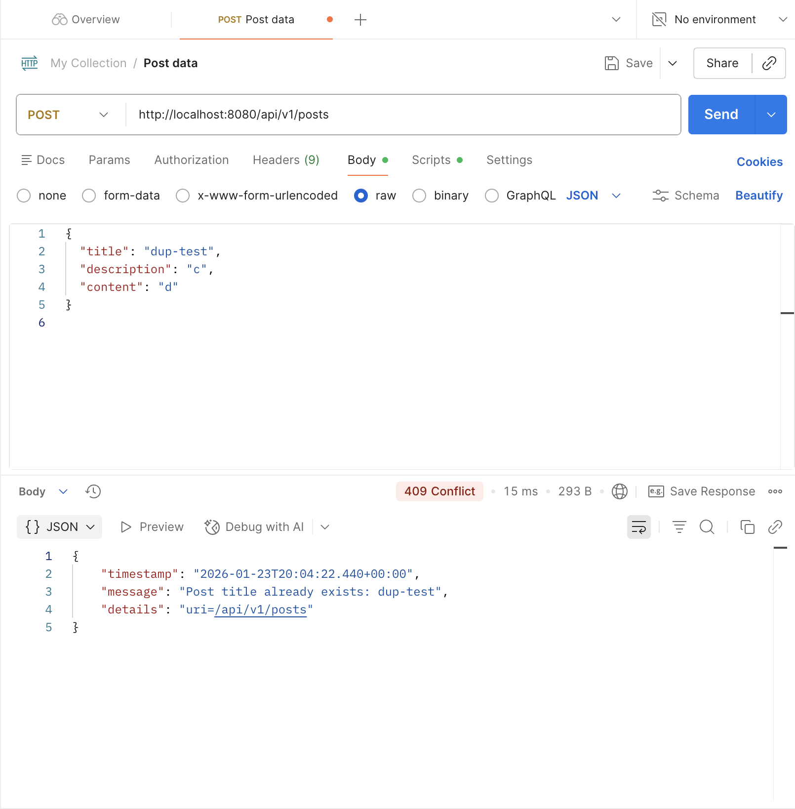

# Assignment10 Yichao Chen
### Q1 Add newly learned annotations to your previous cheatsheet, add explainations for these annotations.
### Q2 Walkthrough sample codes under https://github.com/CTYue/springboot-redbook/commits/06_mapper-exception, you are supposed to bring up the application on your local.

### Q3 Explain why do we need model mappers in Spring, and in what scanrios we need it.
Mappers help automatically convert request and response data structures into application specific DTO. Mappers usually handle response from third party or external services.
### Q4 Provide 3 examples in which model mapper will NOT map succesfully, explain why.
- Field names do not match
  - Model mapper rely on matching field name by default. Such as the source object name is phoneNumbers while the target object name is phone, the mapper cannot automatically match.
- Incompatible field types without a converter
  - When the source and target field type are different data type, such as source field data type is String to LocalDate or String to Enum.
- Different data structure
  - Mapper cannot automatically map complex nested objects to flattened fields. For example, mapping `post.author.name` to `authorName` in DTO.
### Q5 Explain how model mapper cast different data types between source object and target class.
Model Mapper cast different data types need using build in type converter and custom converters.
### Q6 Add your own API exceptions so that when something wrong happens in service layer, your rest API will return your customized response and status code.

### Q7 Explain how Controller Advices work, is there any other approach to do same/similar global API exception handling?
@ControllerAdvice / @RestControllerAdvice provides a global “interceptor” layer for controllers. When a controller method throws an exception, Spring’s ExceptionHandlerExceptionResolver searches for a matching @ExceptionHandler method (first in the same controller, then in @ControllerAdvice classes). The matched handler can build a consistent error response (often via ResponseEntity) with the desired HTTP status code and JSON body. This removes repetitive try-catch blocks from controllers and ensures all endpoints return a standardized error format.
### Q8 What's the difference between throwing a regular exception and a customized API exception that will be eventually thrown to Controller Advice codes? Please provide screenshots to explain your findings.
Throwing a regular exception typically indicates an unexpected system or program error. If such an exception is not explicitly handled, Spring will return a generic error response, most commonly `500 Internal Server Error.`

In contrast, custom API exceptions represent expected business-level errors, such as a resource not found or a duplicate request. These exceptions are intentionally thrown by the service layer and intercepted by `@RestControllerAdvice`, then converted into a convertible object (e.g., 404 Not Found or 409 Conflict).
### Q9 Write some regular expression to restrict the value of attributes that your Post or Comment can have. You may use https://regex101.com/ to construct and test/validate your regular expression.
Post.title Rule: 3–80 chars, no leading/trailing spaces, allowed: letters, digits, spaces, .,!?:;'"()-\
Post.description Rule: optional; if present must contain at least one non-space; max 200\
Comment.content Rule: 1–500 chars, disallow <script (case-insensitive), not blank\
Post.content Rule: 1–5000 chars, must contain at least one non-whitespace
### Q10 Explain Spring framework fundamental principles. And how can they help build business applications?
One core principle is Inversion of Control (IoC), which shifts the responsibility of object creation and dependency management from application code to the Spring container. Through Dependency Injection (DI), components receive their dependencies automatically, resulting in loosely coupled code that is easier to test and modify.

Another key principle is separation of concerns, where different layers of an application (controller, service, repository) are clearly separated. This improves code organization, readability, and scalability in business applications.

Spring also emphasizes aspect-oriented programming (AOP) to handle cross-cutting concerns such as logging, security, and transaction management. By separating these concerns from business logic, applications become cleaner and easier to maintain.

In addition, Spring promotes convention over configuration, reducing boilerplate code and allowing developers to focus on business logic rather than infrastructure setup. Together, these principles help developers build flexible, testable, and scalable business applications efficiently.
### Q11 Explain different types of dependency injection, explain their suitable use cases, and why fielde injection is not recommended in general. Please provide necessary code snippets and screenshots if possible.
Hidden Dependencies
You can't see what dependencies this class needs from the constructor; reading the code is not intuitive; the dependencies are "hidden in the fields."

Detrimental to Unit Testing
Constructor injection: `new PostServiceImpl(mockRepo, mockMapper)` is straightforward.
Field injection: You have to rely on the Spring container, reflection, or a test framework to "inject the fields," making testing more complicated and fragile.

Cannot use `final`, hindering immutable design
Constructor injection allows dependencies to be set as `final`, which is safer; field injection usually only allows non-`final` fields, leading to higher mutability.

More prone to NullPointerExceptions/lifecycle issues
Fields are injected after Spring creates the bean; if someone uses these fields in the constructor, it may result in a NullPointerException (this doesn't happen with constructor injection).

Reduces maintainability and refactoring friendliness
Changes to constructor parameters are immediately exposed at compile time (strong indication); field injection makes it easier for problems to go unnoticed until runtime.
### Q12 Explain different types of application context in Spring framework, with screenshots. You may take https://github.com/CTYue/springIOC for reference.
In Spring, the ApplicationContext is the central interface of the IoC container. It is responsible for loading bean definitions, managing bean lifecycles, and providing dependency injection. Spring provides different implementations of ApplicationContext for different application environments.
### Q13 Compare @Component and @Bean and in which scenario they should be used.
`@Component` and `@Bean` are both used to register object as Spring-managed beans.

`@Component` is class level annotation: When a class is annotated with `@Component`, Spring automatically detects it during component scanning and registers it as a bean. This approach is best suited for application classes that are part of the project’s codebase, such as controllers, services, repositories, and utility classes. It promotes convention over configuration and requires minimal explicit setup.

`@Bean` is method level annotation used inside a @Configuration class: The method returns an object that Spring registers as a bean. This approach is useful when the bean creation requires custom initialization logic, configuration, or when the class cannot be annotated directly, such as third-party library classes. 

`@Component` is preferred for Spring-managed application components discovered via scanning, while @Bean is more suitable for explicitly defining beans with customized creation logic or external dependencies.
### Q14 Explain Spring bean scopes and how to pick the correct bean scope.
Spring bean scopes define the lifecycle and visibility of beans within the Spring container. Choosing the correct scope helps manage resource usage and application behavior.

The most common bean scope is singleton, which is the default scope in Spring. A singleton bean is created once per Spring container and shared across the entire application. It is suitable for stateless components such as services, repositories, and controllers.
### Q15 Explain the difference between bean id and bean class.
The bean class defines what the bean is, while the bean id defines how the bean is identified and accessed within the Spring container.
### Q16 Explain that when a bean has multiple alternative implementations, how will Spring decide which bean implementation to inject/autowire?
When multiple bean implementations match the same dependency type, Spring follows a clear resolution order to decide which bean to inject.

First, Spring tries to match by `@Primary`. If one bean is annotated with `@Primary`, it is chosen as the default implementation when multiple candidates are available.

If no `@Primary` bean is defined, Spring then looks for a qualifier match using `@Qualifier`. The qualifier explicitly specifies which bean name or identifier should be injected, allowing developers to precisely control the selection.

If neither `@Primary` nor `@Qualifier` is used, Spring attempts to match by bean name. If the dependency name matches a bean id, that bean will be injected.

If Spring still cannot resolve the ambiguity, it throws a NoUniqueBeanDefinitionException, indicating that multiple beans were found and no clear choice was provided.

In practice, `@Primary` is used to define a default implementation, while `@Qualifier` is preferred when explicit and fine-grained control over bean selection is required.
