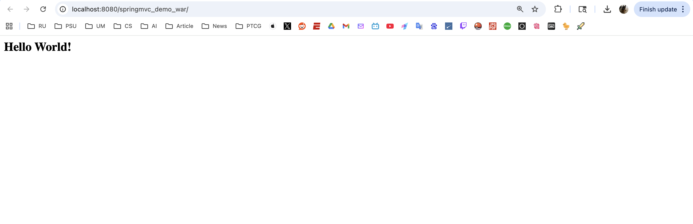
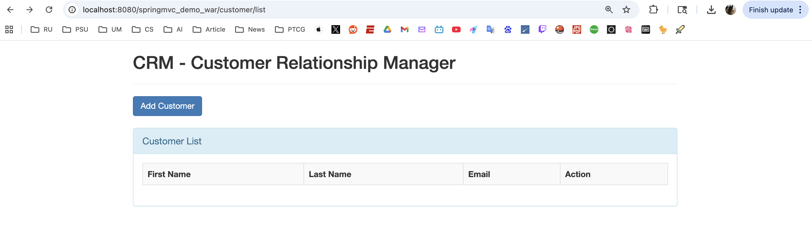
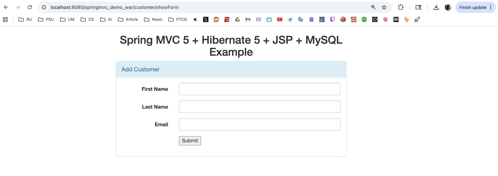
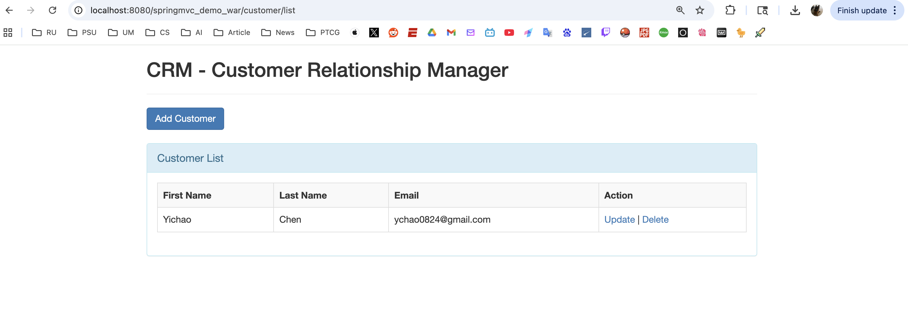
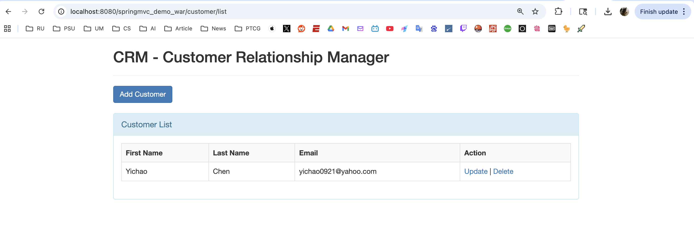
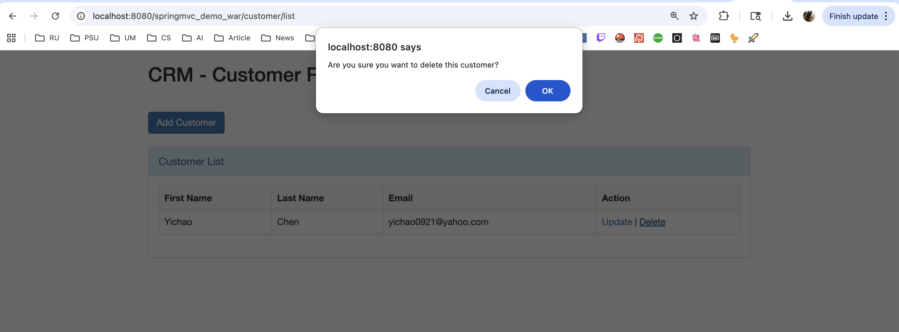
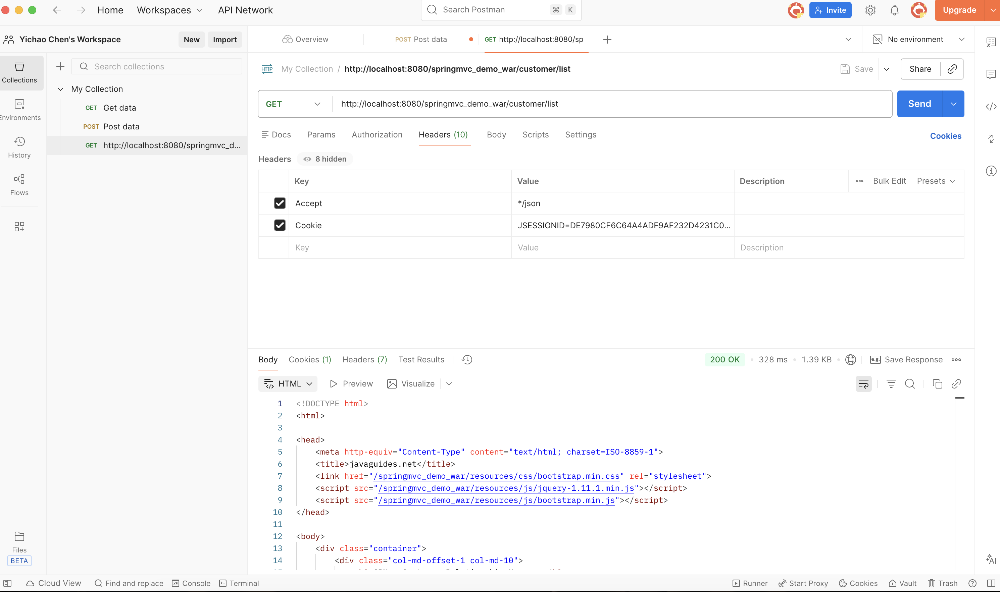

# Assignment11 Yichao Chen

### Q1 List all of the annotations you learned from this class session.
`@RestController`: it combined from @Controller + @ResponseBody return JSON / XML\
`@Controller`: marked it is MVC controller return view pattern like .jsp and index.html\
`@RequestMapping`: reflection to GET and POST
### Q2 Explain tight coupling vs loose coupling and what does Spring IOC do?
Tight coupling: The Component rely on concrete implementations, changes in implementation will affect other component. Such as one class created and rely on other specific class.\
Loose coupling: The class depends on abstract class rather than concrete implementations, typically interacting through interfaces, ensuring flexibility or extensibility.\
Spring IOC: Spring inversion of Control which is how to resolve the tight coupling problem. No like traditional class create instances or implementations. In Spring: Objects not be created by needed Spring container will configure by annotations and manage the dependency. Spring IOC improve the code extensibility and flexibility. 
### Q3 What is MVC pattern?
Model View Controller (MVC) is a software framework which separate the applications data, Business logic and UI. Model is represent application's data and logic. View display the information to user. Controller receive request and send request.   
### Q4 What is Front-Controller?
Front-Controller is a design pattern used for centralize request handling. In this pattern all client request are first receive by a single controller.
### Q5 Explain DispatcherServlet and how it works.
DispatcherServlet is the core component of Spring MVC and the implementation of the Front Controller pattern. It acts as the central entry point for all HTTP requests in a Spring MVC application.\
Executor Flow:
1. Client sends an HTTP request
2. Request goes to DispatcherServlet
3. DispatcherServlet uses HandleMapping to find the controller
4. Controller handle the request and return the result
5. DispatcherServlet process the result(ViewResolve / ResponseBody)
6. Response is return to the client
### Q6 What is JSP and What is Model And View？
JavaServePages is a view technology in Java web applications. It mainly used to generate dynamic HTML content in to HTML page. In MVC JSP belongs to view layer. It is responsible to display data sent from controller.\
In MVC, Model represents the data and business information that the application wants to display. It usually contains objects or attributes created by the Controller and passed to the View.

View represents the presentation layer, which is responsible for rendering the Model data into a user-friendly format, such as HTML pages (e.g., JSP, Thymeleaf).
### Q7 Explain servlet and servlet container, name some servlet implementations and servlet containers other than tomcat
Servlet is a Java used to handle HTTP requests and response in a web application. A Servlet container is a runtime environment that manages servlet. Common Servlet implementation is HttpServlet which is most servlet handle Http request. It also can be extended HttpServlet and override method like `doGet()` and `doPost()`.\
Besides Tomcat, some well-known servlet containers and application servers include：

* Jetty – lightweight and embeddable, often used in microservices
* Undertow – high-performance, non-blocking web server
* GlassFish – a full Java EE (Jakarta EE) reference implementation
* JBoss / WildFly – enterprise-level application server
* WebSphere – IBM enterprise application server
* WebLogic – Oracle enterprise application server
### Q8 Clone this repo, and run it on you local,
Demo: Hello World:

List:

ShowForm:

Add:

Update:

Delete:

Postman:

