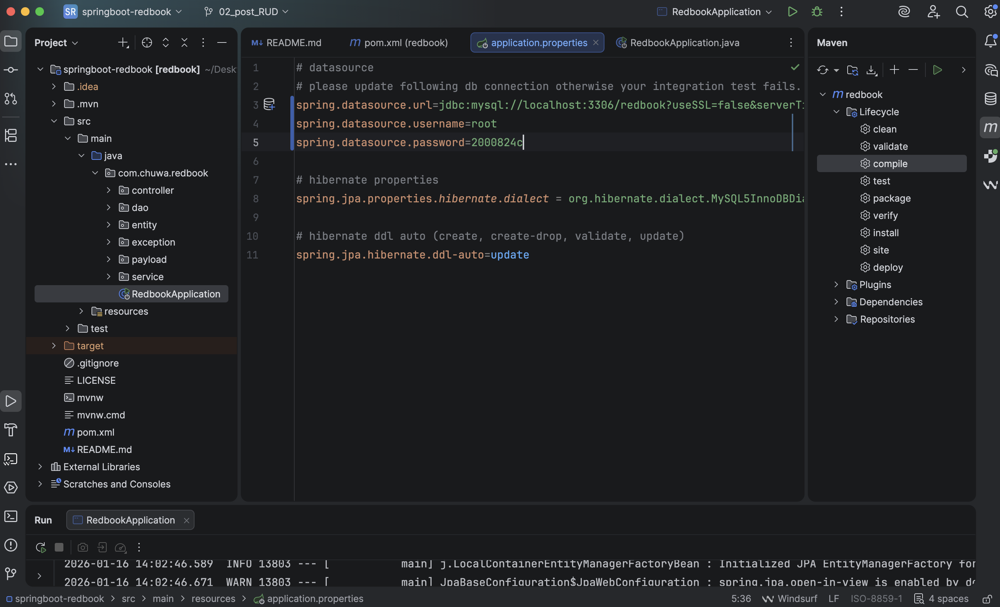
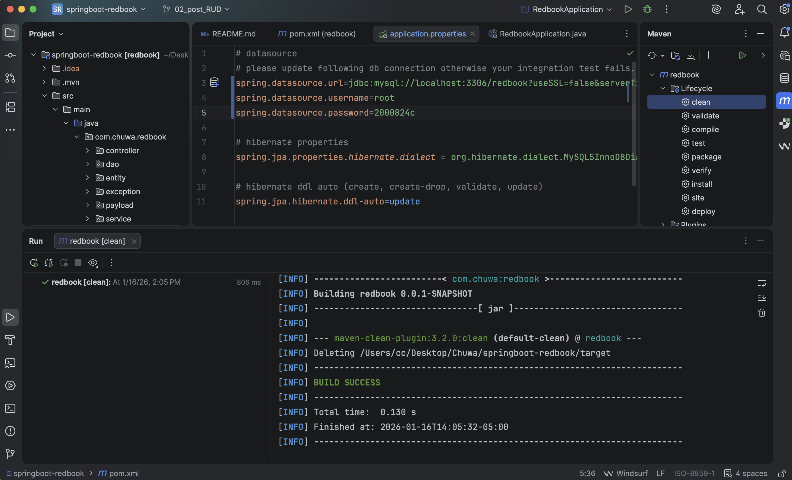
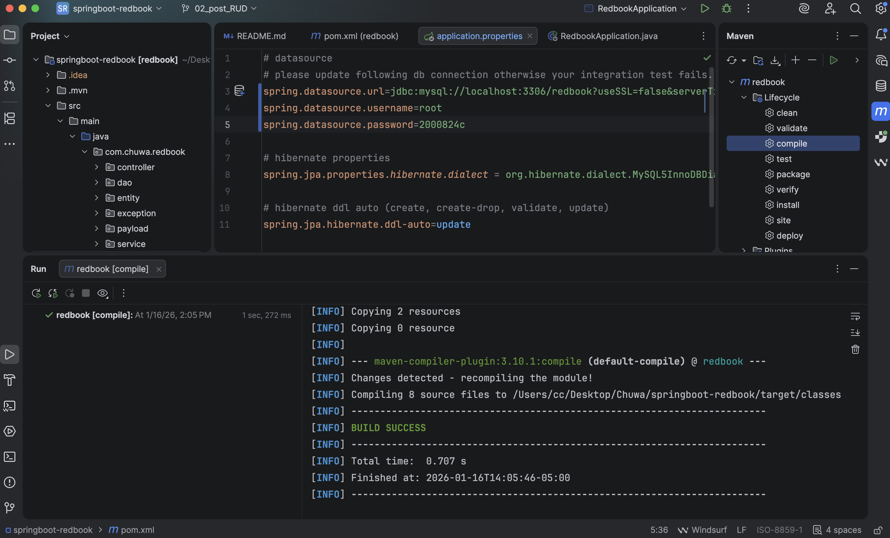
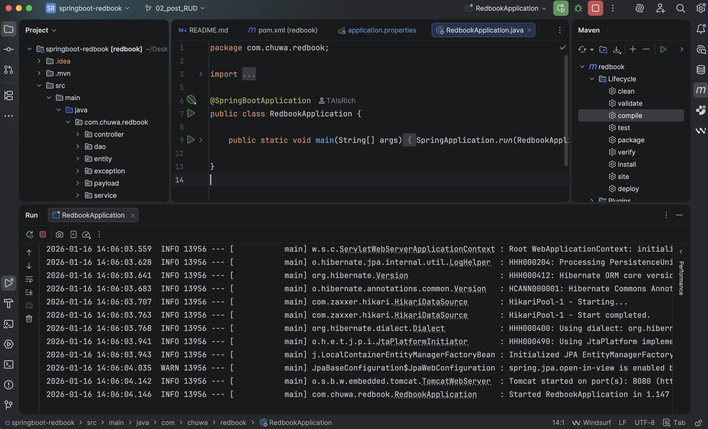

# Assignment 8 Yichao Chen

### 1.clone redbook repository (02_POST_RUD branch) and import to IntelliJ (as a maven project)
### 2.modify your application.proerties file.

### 3.maven clean and compile.
\

### 4.run the application.

### 5.create a postman request to generate a record in database

### Q1 Did you create the table POSTS in the database? if not, who did it for you? Can I change this behavior? (Hint: look at the application.properties file)
No, I did not create the table POSTS in the database. It was created for me by the application. It created by `spring.jpa.hibernate.ddl-auto=update`

Yes, I can change this behavior by modify the `spring.jpa.hibernate.ddl-auto`

### Q2 Is your id in the database same as what you set in your request? why does this happen? (Hint: search the annotations used in your code)

The id stored in the database is not necessarily the same as the id set in the request.\
Although the returned id was 1 in this case, this happened because it was the first record inserted, and the database automatically generated the id starting from 1.

This behavior occurs because the entity uses the `@GeneratedValue` annotation (with `GenerationType.IDENTITY`), which means the primary key is auto-generated by the database.
As a result, the id value provided in the request is ignored, and the database-generated id is used instead.