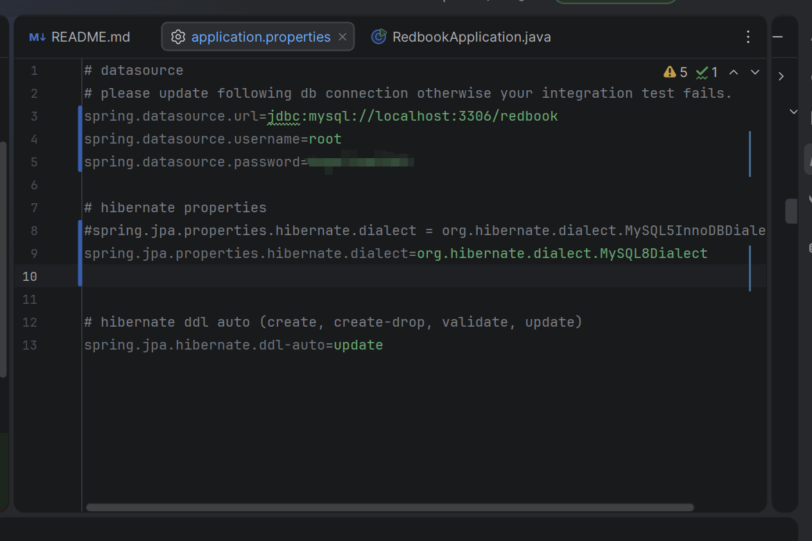
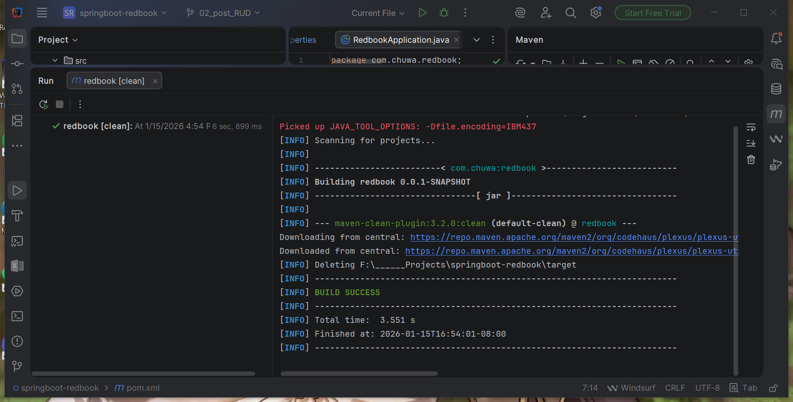
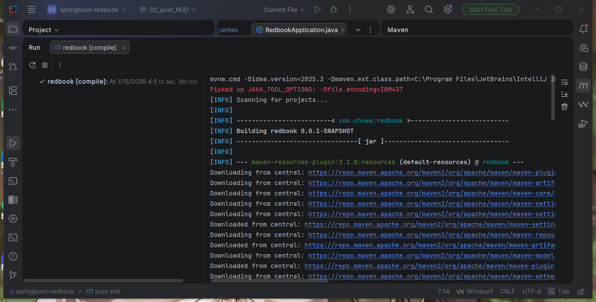
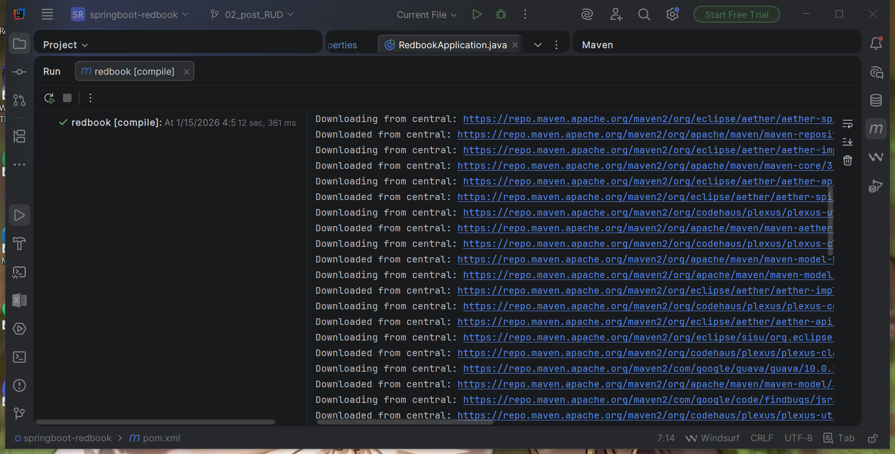
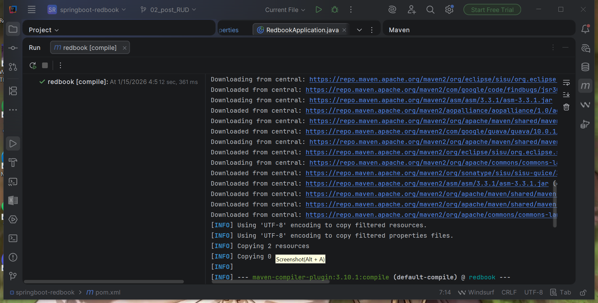
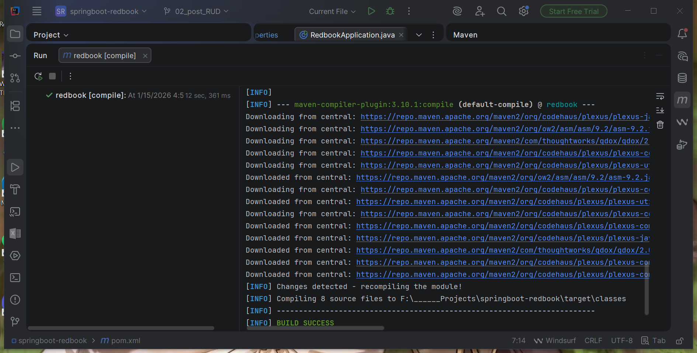
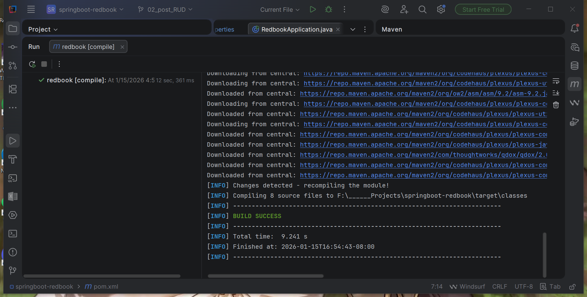
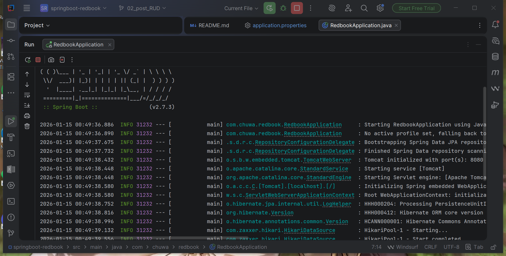
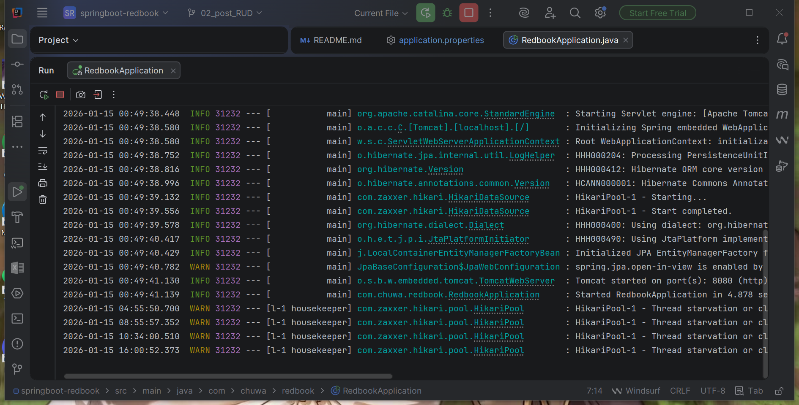
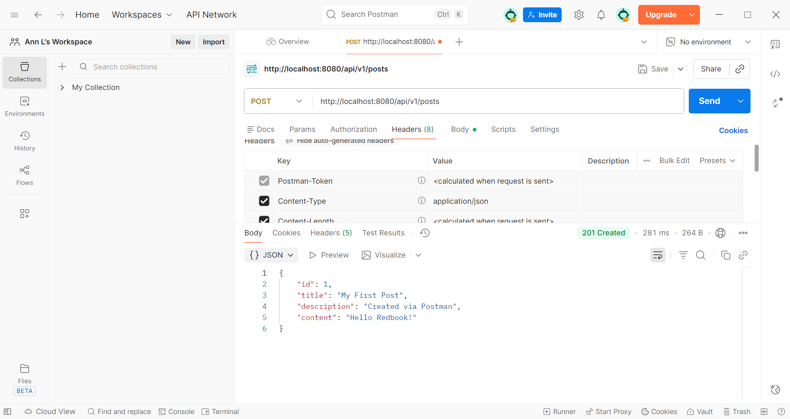

# Chuwa 0114 HW8

## Part 1 - Hands on Practice

### 0: System Setup
OS: Windows(x64)
Database: MySQL Server 8.0.27

---
### 1: Project Setup (clone and import)
Project Succefully cloned and loaded into IntelliJ IDEA as a Maven project with all dependencies

---
### 2: Application Config
Modified the `application.properties` file to match local database setup


---
### 3: Build with Maven 
Maven clean and compiled project succefully

**Clean**


**Compile**






---
### 4: Run with SpringBoot
Run the application



---
### 5: POST with Postman
Create a postman request to generate a record in database


(plus, tested with GET to make sure the data was generated)
.png)

---
## Part 2 - Short Questions
Answer the following questions

---
### Q1: Did you create the table POSTS in the database? if not, who did it for you? Can I change this behavior? (Hint: look at the application.properties file)
No, I am not the one that created the POSTS table. <br>
The table was automatically created by **Hibernate(JPA)** when the Spring application started. <br>
This behavior is controlled by the following configuration in `application.properties`:
```bash
spring.jpa.hibernate.ddl-auto=update
```
With `ddl-auto=update`, Hibernate automatically generates or updates database tables based on the entity classes. <br>
To change this, we cam simply modify the `ddl-auto` value to something else.

---
### Q2: Is your id in the database same as what you set in your request? why does this happen? (Hint: search the annotations used in your code)
No, the `id` stored in the database is **not the same** as the one set (or attempted to be set) in the request body. <br>
This is because the entity uses an auto-generated primary key, which causes the Hibernate (or the database) automatically generates the `id` value when the record is saved, and any `id` provided in the request is ignored. <br>
This ensures that each record has a unique primary key and prevents conflicts or duplicate `id`s.


