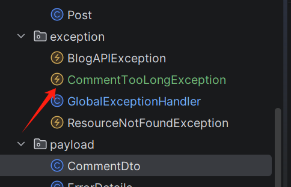
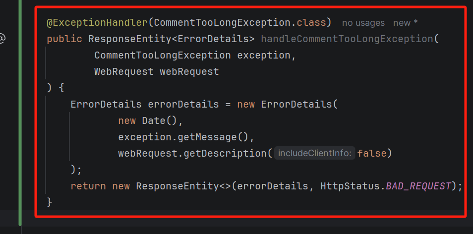
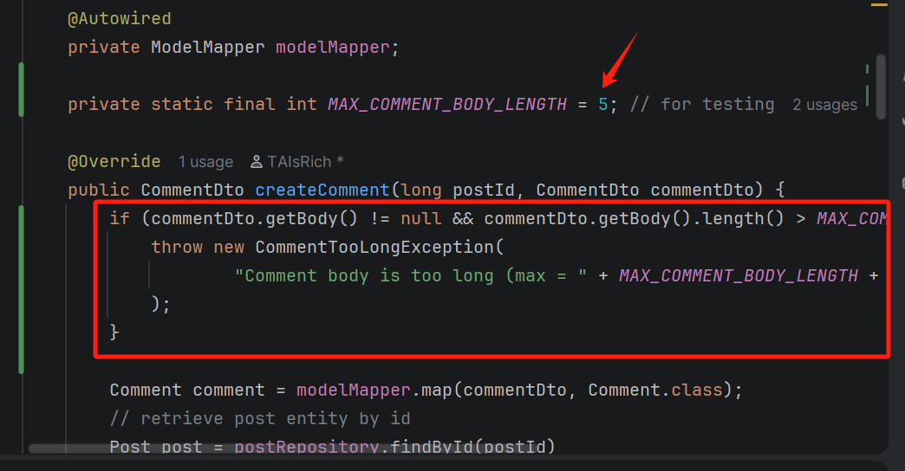
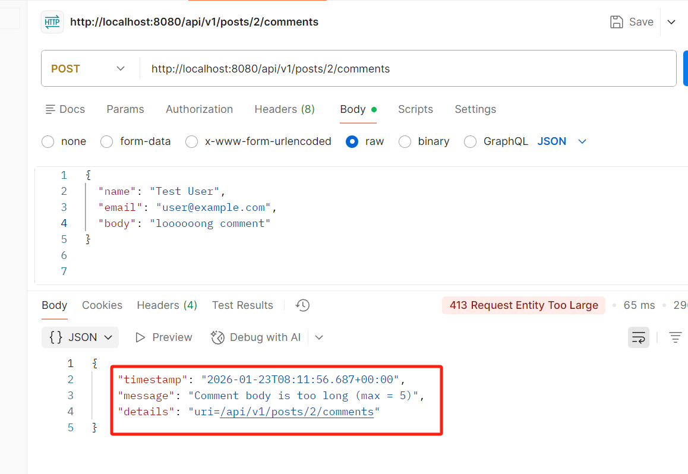
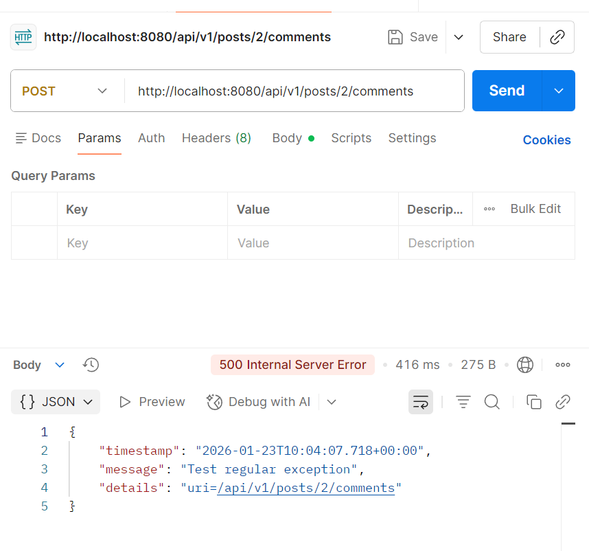

# Chuwa 0121 HW10 - Short Answer
Delin Liang <br>
Due: Jan 23, 2026 <br>

_Note: for Q1, please check the `annotaitons.md` file_
_The executable Spring project with custom edits is in the Coding Folder as a `.zip` file_

---
### Q3 - Explain why do we need model mappers in Spring, and in what scanrios we need it.

**- Why need Model wrappers?**
* To convert between Entity and DTO automatically
* To avoid writing repetitive setter/getter mapping code
* To separate persistence layer (Entity) from API layer (DTO)
* To improve code readability and maintainability
* To keep service layer focused on business logic

**- In what scenarios?**
* Mapping between Entity and DTO in REST APIs
* When entities should not be exposed directly to clients
* Mapping nested objects or collections
* Converting request payloads to entities in create/update APIs
* Medium to large projects with frequent model changes

---
### Q4 - Provide 3 examples in which model mapper will NOT map succesfully, explain why

#### 1. Different naming conventions
```java
// source
class AccountEntity {
    private String givenName;
    private String familyName;
}

// target
class AccountDTO {
    private String firstName;
    private String lastName;
}
```
* By default, ModelMapper maps by identical property names
* Result: since property names are mismatched, the `firstName` and `lastName` fleids will stay `null` unless configured

#### 2. Incompatible types without a converter
```java
// source
class OrderEntity {
    private String createdAt;
}

// target
class OrderDTO {
    private java.time.LocalDate createdAt;
}
```
* ModelMapper cannot reliably convert `String` to `LocalDate` without an explicit converter
* Result: mapping may fail (runtime error) or produce an incorrect value depending on configuration

#### 3. Ambiguous mapping (multiple possible sources for one target field)\
```java
// source
class CustomerEntity {
    private String email;
    private String backupEmail;
}

// target
class CustomerDTO {
    private String email;
}
```
* There are two candidates (`email` and `backupEmail`) for the target email, leading to an ambiguous mapping or not follow your intended business meaning
* Result: wrong value (e.g., picks the unexpected field) unless configured

---
### Q5 - Explain how model mapper cast different data types between source object and target class.

* **Basic Rule**
    * ModelMapper first tries to map properties by **name** and then convert values by **type**
    * **Case 1 - Compatible types**: If source type and target type are the same (or assignable), it copies directly
    * **Case 2 - Primitive ↔ Wrapper (auto-boxing)**: Cast between `int` ↔ `Integer`, `long` ↔ `Long`, etc.
    * **Case 3 - Common simple conversions (via built-in converters)**: For typical simple conversions, ModelMapper uses its internal Converters (ConversionService-style behavior)
        * Example: String ↔ Number (when format is valid)
    * **Case 4 - Enums and custom types**: If no “obvious” conversion, it usually needs **custom mapping**

---
### Q6 - Add your own API exceptions so that when something wrong happens in service layer, your rest API will return your customized response and status code

The following screen shots are showcase of the steps I took, final Spring project is zipped and attached to this submisssion in the `Coding` folder

**Code Changes**
Added a custom `CommentTooLongException` to the code base




**Postman Test**
Tested exception handeling using Postman


---
### Q7 - Explain how Controller Advices work, is there any other approach to do same/similar global API exception handling?

**- How Controller Advices works**
* `@ControllerAdvice` marks a global component that applies to all controllers
* Exceptions thrown from controller or service layer is intercepted 
* Methods annotated with `@ExceptionHandler` define how specific exceptions are handled
* Returns: custom response body (e.g. ErrorDetails), custom HTTP status code

**Other approach**
1. `@ExceptionHandler` inside a single Controller
2. `@ResponseStatus` on exception class
3. Extend `ResponseEntityExceptionHandler`


---
### Q8 - What's the difference between throwing a regular exception and a customized API exception that will be eventually thrown to Controller Advice codes? Please provide screenshots to explain your findings.

For testing, I added a temp trigger in `createComment` of `CommentServiceImpl`
```java
if(true) throw new RuntimeException("Test regular exception");
```
and in Postman it results in a generic `500` error


While as showned in **Q6**, custom exception returns an custom error code with meaningful message body

#### Summary: Key Difference
| Aspect           | Regular Exception     | Customized API Exception |
| ---------------- | --------------------- | ------------------------ |
| HTTP Status      | Default (usually 500) | Explicitly controlled    |
| Response Body    | Generic               | Custom JSON              |
| Business Meaning | Unclear               | Clear & semantic         |
| REST Friendly    | No                    | Yes                      |

---
### Q9 - Write some regular expression to restrict the value of attributes that your Post or Comment can have. You may use https://regex101.com/ to construct and test/validate your regular expression.

In `CommentDto`, I added the following code
```java
import javax.validation.constraints.NotEmpty;
import javax.validation.constraints.Pattern;

public class CommentDto {

    private long id;
    private String name;

    @NotEmpty(message = "Email should not be null or empty")
    @Pattern(
            regexp = "^[A-Za-z0-9]+@[A-Za-z0-9]+\\.[A-Za-z]+$",
            message = "Email must follow the format: lettersOrDigits@lettersOrDigits.domain"
    )
    private String email;
    private String body;
    ...
}
```

And in Postman, when I test with the following malformated email
```JSON
{
  "name": "Test User",
  "email": "aaabbb",
  "body": "loooooong comment"
}
```

it returns the following error
```JSON
{
    "timestamp": "2026-01-23T10:20:29.452+00:00",
    "message": "Validation failed for argument [1] in public org.springframework.http.ResponseEntity<com.chuwa.redbook.payload.CommentDto> com.chuwa.redbook.controller.CommentController.createComment(long,com.chuwa.redbook.payload.CommentDto): [Field error in object 'commentDto' on field 'email': rejected value [aaabbb]; codes [Pattern.commentDto.email,Pattern.email,Pattern.java.lang.String,Pattern]; arguments [org.springframework.context.support.DefaultMessageSourceResolvable: codes [commentDto.email,email]; arguments []; default message [email],[Ljavax.validation.constraints.Pattern$Flag;@11bbdfac,^[A-Za-z0-9]+@[A-Za-z0-9]+\\.[A-Za-z]+$]; default message [Email must follow the format: lettersOrDigits@lettersOrDigits.domain]] ",
    "details": "uri=/api/v1/posts/2/comments"
}
```

---
### Q10 - Explain Spring framework fundamental principles. And how can they help build business applications?

#### 1. Inversion of Control (IoC)
* Spring manages object creation and lifecycle instead of developers
* Objects are injected rather than manually instantiated
* Benefit: reduces coupling and improves testability

#### 2. Dependency Injection (DI)
* Dependencies are provided by the framework (constructor, setter, field)
* Components depend on interfaces, not implementations
* Benefit: easier to replace, mock, and extend components

#### 3. Aspect-Oriented Programming (AOP)
* Separates cross-cutting concerns (logging, security, transactions)
* Applied via aspects instead of duplicated code
* Benefit: cleaner business logic and better separation of concerns

#### 4. Declarative Programming via Annotations
* Behavior is configured using annotations instead of boilerplate code
* Examples: @Transactional, @Controller, @Service
* Benefit: improves readability and reduces configuration complexity

#### 5. Layered Architecture Support
* Clear separation of Controller, Service, Repository layers
* Each layer has a single responsibility
* Benefit: scalable, maintainable, and team-friendly code structure

---
### Q11 - Explain different types of dependency injection, explain their suitable use cases, and why fielde injection is not recommended  in general. Please provide necessary code snippets and screenshots if possible.

1) **Constructor Injection**
    * Default choice for most services/components
    * Required dependencies (cannot be `null`)
    * Best for unit testing (easy to pass mocks)
    * Pros:
        * Allows `final` fields (immutable design)
        * Ensures dependency is provided at object creation time
    * Sample code
    ```java
    @Service
    public class PostServiceImpl implements PostService {
        private final PostRepository postRepository;

        public PostServiceImpl(PostRepository postRepository) {
            this.postRepository = postRepository;
        }
    }
    ```

2) **Setter Injection**
    * Useful for optional dependencies
    * Or when you need to change dependencies after construction (rare)
    * Sample code
    ```java
    @Service
    public class PostServiceImpl implements PostService {
        private PostRepository postRepository;

        @Autowired
        public void setPostRepository(PostRepository postRepository) {
            this.postRepository = postRepository;
        }
    }
    ```

3) **Field Injection**
    - Why it is not recommended
        * Hidden dependencies (not visible in constructor signature)
        * Harder to unit test (requires Spring context or reflection to inject)
        * Cannot make dependency final (less safe, less explicit)
        * Encourages tight coupling to Spring

---
### Q13 - Compare @Component and @Bean and in which scenario they should be used.

#### `@Component`
* Used to mark a **class** as a Spring-managed bean
* Discovered automatically through component scanning
* Commonly used with stereotype annotations:`@Service`, `@Repository`, `@Controller`
* **When to use**
    * You own the source code
    * You want Spring to manage the class automatically
    * Typical for application-level components

#### `@Bean`
* Used on a method inside a @Configuration class
* The return object of the method is registered as a bean
* Requires explicit bean creation logic
* **When to use**
    * You do not own the class source code (third-party libraries)
    * You need custom initialization logic
    * You want full control over how the bean is created

### Key Difference
| Aspect         | `@Component`        | `@Bean`                         |
| -------------- | ------------------- | ------------------------------- |
| Applied to     | Class               | Method                          |
| Bean discovery | Component scanning  | Explicit configuration          |
| Typical use    | Application classes | Third-party or customized beans |
| Flexibility    | Less                | More                            |


---
### Q14 - Explain Spring bean scopes and how to pick the correct bean scope.
Bean scope defines the lifecycle and visibility of a Spring bean. It controls how many instances of a bean Spring creates and where they are shared

#### Common Types
* **Singleton (default)**: One bean instance per Spring container. Best for stateless services and shared components (Service, Repository). Low memory cost, easy to manage and cache
* **Prototype**: A new bean instance is created every time it is requested. Best for stateful objects or objects with short lifecycle. Avoid shared state issues
* **Request (web only)**: One bean instance per HTTP request. Best for request-specific data and web-layer processing
* **Session (web only)**: One bean instance per HTTP session. Best for user-specific session data, login or shopping-cart related state

#### How to choose
* Use singleton for most services (default and recommended)
* Use prototype when the bean holds state
* Use request/session only in web applications with per-request or per-user state
* Avoid wide scopes unless necessary to reduce complexity

---
### Q15 - Explain the difference between bean id and bean class.
Bean id identifies a specific bean instance in the container, while bean class defines the type and implementation of that bean<br><br>
**Chart view with details**
| Aspect     | Bean ID                   | Bean Class             |
| ---------- | ------------------------- | ---------------------- |
| Meaning    | Identifier of a bean      | Java type of the bean  |
| Purpose    | Used to find a bean       | Defines implementation |
| Uniqueness | Must be unique in context | Can be reused          |
| Quantity   | One per bean              | Many beans can share   |

---
### Q16 - Explain that when a bean has multiple alternative implementations, how will Spring decide which bean implementation to inject/autowire?

#### **Default behavior**
* Spring autowires by type
* If only one bean of that type exists → it is injected
* If multiple beans of the same type exist → Spring throws an exception: `NoUniqueBeanDefinitionException`

#### **Steps to take**
1. `@Primary` (default preference): Marks one bean as the default choice
2. `@Qualifier` (explicit selection): Specifies exactly which bean to inject
3. Bean name matching: If autowiring by type fails, Spring may try bean name matching.Bean name matches the field or parameter name
4. `@Profile`: Beans are loaded only when a specific profile is active
5. `@Conditional`: Bean creation depends on custom conditions


