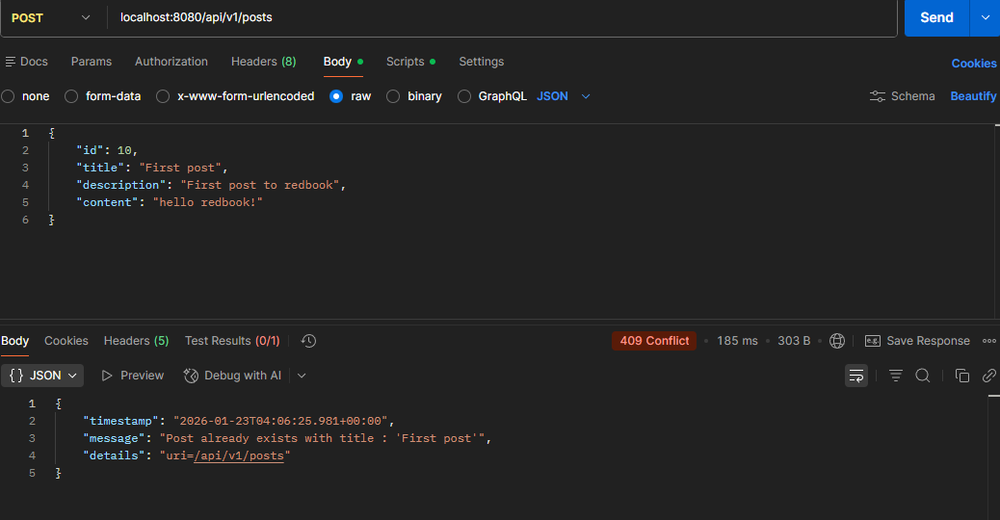

### 3. Why do we need model mappers in Spring?

- Model mapper could help us automatically convert request/response struct to our own DTO struct.
- We usually use model mapper when we need to use the response from third-party API/service


---

### 4. Examples in which model mapper will not map succesfully

- Property names mismatched
    ```java
    // source
    class UserEntity{
        private String firstname;
    }
    // target
    class UserDTO{
        private String fullname;
    }
    ```
By default, model mapper relies on matching property names. In this case, the mapped UserDTO will have `fullname = null` 
- Nested object 
    ```java
    // source
    class UserEntity{
        private Address address;
    }
    class Address{
        private String city;
    }
    // target
    class UserDTO{
        private String city;
    }
    ```
Model mapper could not flat nested object automatically without explicitly configuration
- Target class property is not writable
    ```java
    // source
    class UserEntity{
        private String firstname;
    }
    // target
    class UserDTO{
        final private String fullname;
        public UserDTO(String fullname) {
            this.fullname = fullname;
        }
    }
    ```
Model mapper requires `no-argument` constructor and `setters` method to assign values.

---

### 5. How ModelMapper casts different data types?

- Default behavior:
  - primitive types and their wrappers (`int` and `Integer`, `long` and `Long`, etc.)
  - `String` to numeric types (e.g `String "123"` to `Integer 123`)
  - `Enum` to `String` based on enum name
  - Compatible date/time types
- Custom behavior: developers can also register **custom converters**
    ```java
    Converter<String, LocalDate> stringToLocalDate = 
        ctx -> ctx.getSource() == null ? null 
                : LocalDate.parse(ctx.getSource(), DateTimeFormatter.ofPattern("yyyy-MM-dd"));
    ModelMapper modelMapper = new ModelMapper();
    modelMapper.addConverter(stringToLocalDate);
    ```
  
---

### 6. Custom Exception



---

### 7. How `@ControllerAdvice` works? Any other approach?

1. An HTTP request hits a `@Controller` method.
2. The controller throws an exception.
3. The exception was thrown up to Spring's `DispatherServlet`.
4. Spring checks for an `@ExceptionHandler`:
   - First check in the same controller
   - Then check in any matching `@ControllerAdvice`
5. The matching handler method executes.
6. Wrap the exception into an HTTP response

Yes, one of the approach is to implement customized global `HandlerExceptionResolver`

--- 

### 8. Difference between throwing regular exception and customized API exception

- Regular exception examples: IllegalArgumentException, NullPointerException, RuntimeException. `@ControllerAdvice` can catch it, but it usually only knows:
  - the exception class (often too generic)
  - the message (often not stable / not meant for clients)
- Therefore, the result is commonly:
  - generic HTTP 500, or 
  - overly broad mappings (e.g., everything becomes 400/500)
Which is Hard for clients to distinguish business cases like `NOT_FOUND` vs `CONFLICT` vs `VALIDATION_ERROR`.

---

### 9. Add regular expression to help constrain comment/post

```java
@Entity
@Table(
        name = "posts",
        uniqueConstraints = {
                @UniqueConstraint(columnNames = {"title"})
        }
)
public class Post {

    @Id
    @GeneratedValue(strategy = GenerationType.IDENTITY)
    private Long id;
    
    // ...
    
    @Column(name = "content", nullable = false)
    @NotBlank(message = "Content cannot be blank")
    @Size(min = 20, max = 10000, message = "Content must be between 20 and 10000 characters")
    @Pattern(regexp = "^[\\w\\s.,!?'\\-:;()\"@#$%&*+=\\[\\]{}|\\\\/<>~`]+$",
            message = "Content contains invalid characters")
    private String content;

    // ...
}
```

```java
@Entity
@Table(name = "comments")
public class Comment {
    @Id
    @GeneratedValue(strategy = GenerationType.IDENTITY)
    private long id;

    // ...

    @NotBlank(message = "Body cannot be blank")
    @Size(min = 5, max = 2000, message = "Body must be between 5 and 2000 characters")
    @Pattern(regexp = "^[\\w\\s.,!?'\\-:;()\"@#]+$",
            message = "Body contains invalid characters")
    private String body;

    // ...
}
```
---

### 10. Spring framework fundamental principles

- Inversion of Control and Dependency Injection
  - object do not create their dependencies explicitly
  - Spring creates and injects them
  - e.g.
  instead of service create its dependency on its own:
  ```java
    Service service = new Service(new Repository());
  ```
  dependency is injected from outside:
  ```java
    @Service
    class Service {
        private final Repository repo;

        Service(Repository repo) {
            this.repo = repo; // injected from outside
        }
    }
  ```
- Aspect-Oriented Programming
  - keep business code **clean**
  - no duplicated boilerplate
  - use annotation to separate cross-cutting concerns from core business logic.
- Convention over Configuration
- Layered Architecture Support
  - Controller - Service - DAO

---

### 13. Compare @Component and @Bean, and when to use each

### @Component
- Used to mark a **class** as a Spring-managed bean.
- Discovered automatically through **component scanning**.
- Commonly used for application-level components such as services, repositories, and controllers.
- Requires minimal configuration and follows convention over configuration.

**Use @Component when:**
- The class is part of your own application code.
- You want Spring to automatically detect and manage it.
- The class fits naturally into a layered architecture (service, controller, repository).

---

### @Bean
- Used to define a bean via a **method** in a configuration class.
- The method explicitly returns the object that Spring manages.
- Gives full control over how the object is created and configured.

**Use @Bean when:**
- You need to register a **third-party class** that you cannot annotate.
- Bean creation requires custom logic, conditional checks, or complex setup.
- You want fine-grained control over initialization.

---

### Key difference summary
- @Component relies on **class-level annotation and scanning**
- @Bean relies on **method-level explicit configuration**
- @Component is simpler; @Bean is more flexible

---

### 14. Spring Bean Scopes and how to choose the correct one

### What is a bean scope?
A bean scope defines:
- How many instances of a bean Spring creates
- How long a bean instance lives

---

### Common Spring bean scopes

#### Singleton (default)
- One instance per Spring container.
- Shared across the entire application.
- Most commonly used scope.

**Use when:**
- The bean is stateless.
- The bean represents shared business logic or infrastructure.

---

#### Prototype
- A new instance is created every time the bean is requested.
- Spring does not manage the full lifecycle after creation.

**Use when:**
- The bean holds mutable, per-use state.
- Instances should not be shared.

---

#### Request (Web applications only)
- One instance per HTTP request.

**Use when:**
- Data is tied to a single request (e.g., request context).

---

#### Session (Web applications only)
- One instance per HTTP session.

**Use when:**
- Data is tied to a user session.

---

### How to choose the right scope
- Prefer **singleton** by default.
- Use **prototype** only when sharing state would cause problems.
- Use **request/session** sparingly and only for web-specific state.

---

### 15. Difference between bean id and bean class

### Bean ID
- The **unique name** used by Spring to identify a bean in the container.
- Used when retrieving or injecting beans by name.
- Must be unique within the Spring context.

---

### Bean Class
- The **type (class or interface)** of the bean.
- Used by Spring primarily for dependency injection by type.
- Multiple beans can share the same class but must have different IDs.

---

### Key difference
- Bean ID answers: “Which bean is this?”
- Bean class answers: “What type of object is this?”

---

### 16. How Spring decides which bean implementation to inject

### Default behavior
- Spring injects dependencies **by type**.
- If exactly one bean matches the required type, it is injected automatically.

---

### When multiple implementations exist
Spring cannot decide automatically and requires extra information.

### Ways Spring resolves ambiguity

1. **Primary bean**
    - One bean can be marked as the default choice.
    - Spring injects it when no other preference is specified.

2. **Qualifier**
    - Explicitly tells Spring which bean to inject by name.
    - Used when multiple beans of the same type exist.

3. **Injection by name**
    - Spring may match the dependency name with a bean name.
    - Less explicit and not recommended compared to qualifiers.

4. **Collection injection**
    - Spring injects all implementations as a list or map.
    - Selection is done at runtime based on business logic.

5. **Profiles or conditions**
    - Beans are loaded only in certain environments.
    - Allows different implementations for dev, test, or production.

---


