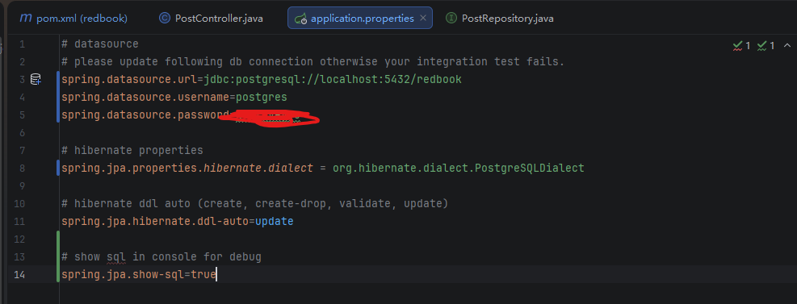
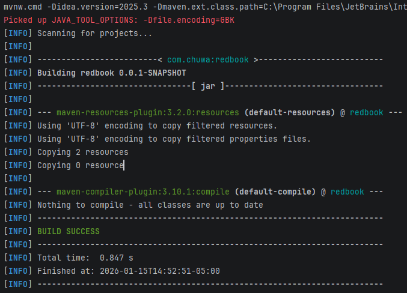
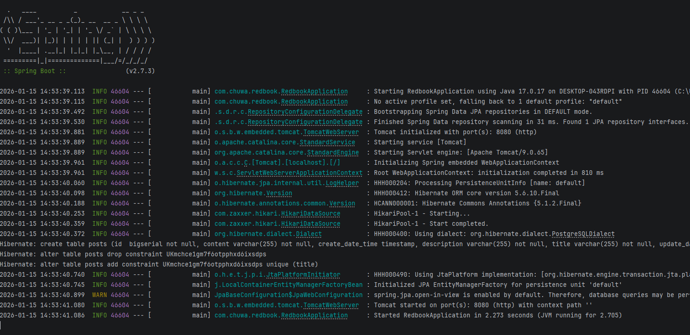
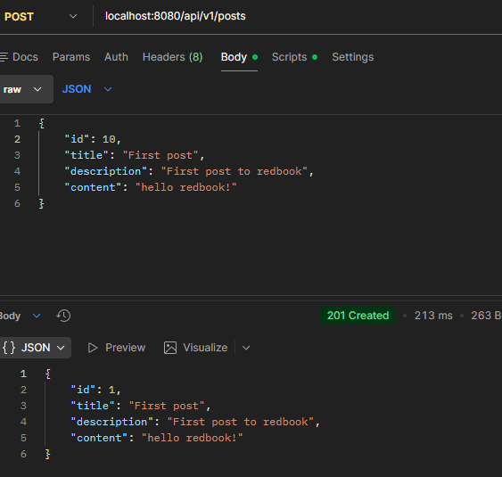

# Chuwa Backend Java – Hands-on Assignment

**Name:** Yuqi Li  
**Course:** Backend – Java  
**Due:** Jan 16, 2026, 5:30 PM Pacific Time  
**Database:** PostgreSQL

---

## 1. Clone Repository and Checkout Branch

```bash
git clone https://github.com/CTYue/springboot-redbook.git
git checkout 02_post_RUD
```

---

## 2. Import Project into IntelliJ

The project was imported into IntelliJ IDEA as a Maven project and all dependencies were loaded successfully.

---

## 3. Application Configuration

The `application.properties` file was updated to connect the application to a PostgreSQL database.

**Screenshot:**  


---

## 4. Build Project with Maven

The project was built successfully using Maven without any errors.

**Screenshot:**  


---

## 5. Run Spring Boot Application

The Spring Boot application started successfully and connected to the PostgreSQL database.

**Screenshot:**  


---

## 6. Create Record Using Postman

A POST request was sent using Postman to create a new record in the database.

**Screenshot (Postman Request & Response):**  


---

## 8. Questions

### Q1. Did you create the table POSTS in the database? If not, who did it for you? Can this behavior be changed?

**Answer:**  
I did not manually create the POSTS table. The table was automatically created by Hibernate when the application started, based on the entity definitions. This behavior is controlled by the JPA configuration in `application.properties`, and it can be changed by modifying the Hibernate DDL auto setting. The PostgreSQL database itself must be created before running the application.

---

### Q2. Is your ID in the database the same as what you set in your request? Why does this happen?

**Answer:**  
No, the ID stored in the database is not the same as the one provided in the request. This is because the entity uses an auto-generated primary key, so the database or Hibernate generates the ID automatically instead of using the client-provided value.

