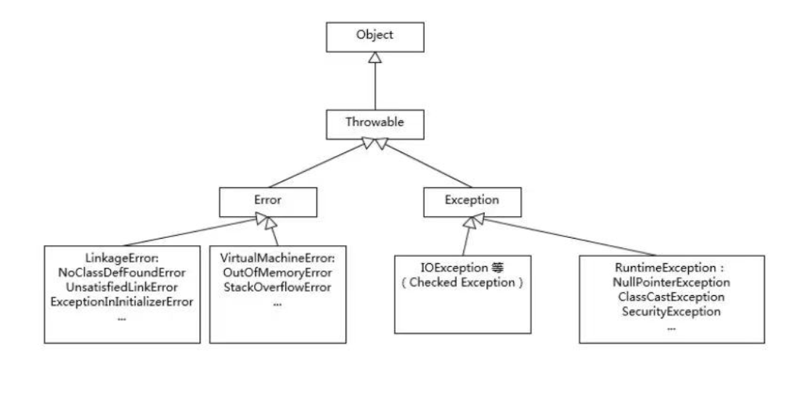

### Q1\. What are the three major categories of exceptions in Java's exception hierarchy? For each category, explain: (1) Whether it must be handled at compile-time, (2) Common examples, (3) Best practices for handling.

* Based on the hierarchy diagram and lists in the class slides:
* 
1. Error
* Handling: Not typically handled by application code (related to JVM).
* Examples: `OutOfMemoryError` (e.g., memory overflow), `StackOverflowError` (often CPU related), `LinkageError`, `VirtualMachineError`.
* Best Practice: Usually indicates serious problems (like running out of system resources) that a reasonable application should not try to catch.
2. Checked Exception (Exception)
* Handling: Must be handled at compile-time using `try-catch` or declared with `throws`.
* Examples: `IOException` (e.g., FileNotFound), `SQLException`, `ClassNotFoundException`.
* Best Practice: Use when the client can reasonably be expected to recover from the exception.
3. Unchecked Exception (RuntimeException)
* Handling: Not required to be handled explicitly at compile-time.
* Examples: `NullPointerException (NPE)`, `IndexOutOfBoundsException`, `ClassCastException`, `SecurityException`.
* Best Practice: Use for programming logic errors or conditions that the client cannot reasonably recover from.

---

### Q2\. Explain the execution order of try-catch-finally blocks. If both the catch block and finally block contain return statements, which value will be returned? Why is it strongly discouraged to use return statements in finally blocks?

* Execution Order: The `try` block executes first. If an exception occurs, the matching `catch` block executes. Regardless of whether an exception occurred or was caught, the `finally` block always executes.
* Return Precedence: If both blocks have return statements, the receiving method will get the returned value from the `finally` block.
* Why Discouraged: Using return in `finally` overrides the return value from `try` or `catch`, which can mask exceptions or silently change the intended logic of the method. The class slides demonstrate this with an example where `return 3` (from catch) is discarded in favor of `return 5` (from finally).

---

### Q3\. What is the "catch scope should be from small to large" rule? Why must specific exception types (like OrderNotFoundException) be caught before general ones (like Exception)? What happens if you violate this rule?
* Rule: Catch blocks must be ordered from the most specific exception type to the most general (Small -> Large).
* Reason: If a general exception (like `Exception`) is caught first, it will match all exceptions, making the subsequent specific catch blocks unreachable (dead code).
* Consequence: The compiler will typically issue an error for unreachable code. The class slides show a "Wrong" example where `Exception` is caught before `OrderNotFoundException`, effectively hiding the specific handler.

---

### Q4\. Compare throw and throws: (1) Where is each used in code? (2) What follows each keyword? (3) Provide one practical example demonstrating both keywords working together in a DAO-Service-Controller architecture.
* `throw`:
* Usage: Used inside a method body or block to actively trigger an exception.
* Followed by: A new exception instance (e.g., `throw new RuntimeException();`).
* `throws`:
* Usage: Used in the method signature (declaration) to declare potential exceptions.
* Followed by: Exception class names (e.g., `throws OrderNotFoundException`, `DBException`).
* Example (based on class slide concepts):
* DAO Method: `public Order findOrder(String id) throws OrderNotFoundException { ... throw new OrderNotFoundException(); }`.
* Caller: `public void process() { try { findOrder("1"); } catch (OrderNotFoundException e) { ... } }`

---

### Q5\. What is try-with-resources syntax (introduced in Java 7)? What interface must a class implement to be used with try-with-resources? Explain the execution order when multiple resources are declared.
* Syntax: `try(Resource res = new Resource()) { ... }` allows declaring resources that will be closed automatically.
* Interface: The resource class must implement the `AutoCloseable` (or `Closeable`) interface.
* Execution: Resources are opened in the order they are declared. They are automatically closed at the end of the block in the reverse order of their creation. The class slides emphasize this is for "timely release of resources" (及时释放资源).

---

### Q6\. When creating custom exceptions, how do you decide between extending Exception vs extending RuntimeException? Provide criteria for each choice and one example scenario for each.
* Extending `Exception` (Checked):
* Criteria: Use when you want to force the caller to explicitly handle the exception logic.
* Example: `OrderNotFoundException` (Class slide example explicitly extends Exception).
* Extending `RuntimeException` (Unchecked):
* Criteria: Use for system errors, configuration issues, or logic bugs where the caller likely cannot recover.
* Example: `CharlesException` or `ApiException` (Class slide examples explicitly extend `RuntimeException`).

---

### Q7\. Explain the two important features of Enum: "Every element is in values" and "Every element is a constructor". How would you implement an Enum with a private constructor that accepts parameters?
* In Values: You can iterate over all enum constants using the static `.values()` method.
* Constructor: Each enum constant is an object that calls the constructor defined in the enum class.
* Implementation Steps:
* Define a private variable (e.g., `private int value;`).
* Define a private constructor (e.g., `private Day(int value) { this.value = value; }`).
* Define the constants passing the value (e.g., `MONDAY(1), TUESDAY(2);`).

---

### Q8\. Describe the popular Enum template pattern (Interface + Enum + Exception). What are its four components? How does using an interface type (IErrorCode) allow the exception class to accept multiple different enum types?
* Pattern Components:
* Interface (`IErrorCode`): Defines contract methods like `getCode()` and `getMessage()`.
* Enum (ResultCode): Implements the interface and defines specific error constants (e.g., `SUCCESS(200, "...")`).
* Private Constructor: In the Enum to initialize the code/message fields.
* Exception (`ApiException`): Aggregates the interface (`IErrorCode`), allowing it to accept any enum that implements that interface in its constructor.
* Benefit: The exception class (`ApiException`) depends on the interface (`IErrorCode`), not a specific Enum. This allows us to have multiple error Enums (e.g., `ResultCode`, `serErrorCode`, `SystemErrorCode`) that can all be thrown using the same `ApiException` class.

---

### Q9\. Compare the three major Collection interfaces: List, Set, and Queue. For each, explain: (1) Ordering characteristics, (2) Duplicate element handling, (3) Most commonly used implementation class, (4) One typical use case.
* Based on the Collection hierarchy on the class slides:
1. List
* Ordering: Ordered (maintains insertion order).
* Duplicates: Allowed.
* Implementation: ArrayList or LinkedList.
* Use Case: Storing a sequence of items where index-based access is needed.
2. Set
* Ordering: Generally unordered (though LinkedHashSet maintains insertion order and TreeSet is sorted).
* Duplicates: Not allowed (Unique elements).
* Implementation: HashSet.
* Use Case: Removing duplicates from a collection or checking for existence.
3. Queue
* Ordering: typically FIFO (First-In-First-Out).
* Duplicates: Generally allowed.
* Implementation: LinkedList or PriorityQueue.
* Use Case: Task scheduling or processing data streams.

---

### Q10\. Explain the difference between HashMap and Hashtable. Why is Hashtable considered obsolete? What are the modern alternatives for thread-safe Map implementations?
* Hashtable: It is synchronized (thread-safe) but does not allow null keys or values.
* HashMap: It is not synchronized (not thread-safe), but allows one null key and multiple null values. 
* Why Obsolete: Hashtable uses method-level synchronization which makes it slow and inefficient compared to modern alternatives. It is a legacy class.
* Modern Alternatives: For thread safety, developers now typically use ConcurrentHashMap (standard industry practice) or Collections.synchronizedMap(). The class slides illustrate HashMap, LinkedHashMap, and TreeMap as the modern implementations under the Map hierarchy.

---
